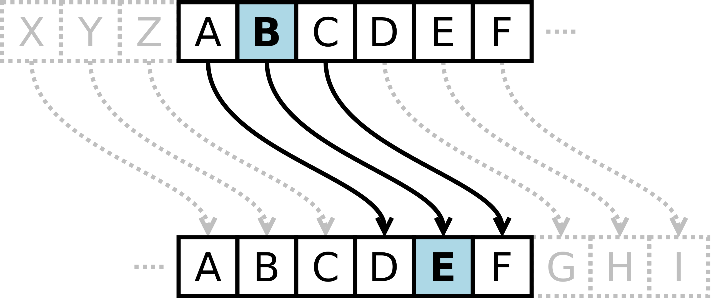
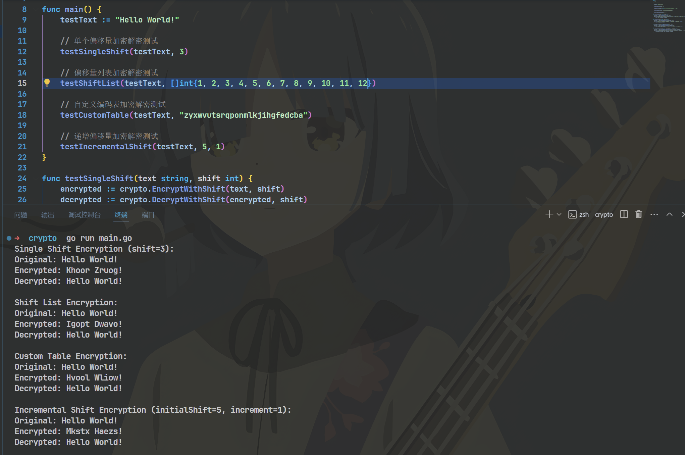

### 0x00 凯撒密码简单介绍
凯撒密码以字母表a-z, A-Z对原文进行移位替换生成密文, 替换的偏移量(shifts)为凯撒密码的密码, 已知字母表有26个字母, 排除位偏移量为0的情况(自身), 可能的替换方式为有限的25种(1-26), 因此凯撒密码是一种极为不安全的密码, 破解者可以遍历25种可能来得到可能符合**语义**的原文。

常规的凯撒密码可以表示为下图:


变异凯撒常出于CTF中, 根据凯撒密码的加密方式, 可以得到以下三种变异方式:
1. 每个字母的替换位移不同, 并依次增加指定位数. 例如原文为Hello, H向后偏移2位, e向后偏移3位, l向后偏移4位, 依次累加
2. 各字母位移的数量由指定的列表决定. 例如原文为Hello, 位移列表为[1,4,5,3,2]
3. 更改字母表, 即原字母表不再是a-z, A-Z.


### 0x01 代码实现
对于常规凯撒加密与3种变异凯撒的加密与解密使用代码实现如下:

```go
package crypto

import (
	"strings"
)

const (
	lowercaseAlphabet = "abcdefghijklmnopqrstuvwxyz"
	uppercaseAlphabet = "ABCDEFGHIJKLMNOPQRSTUVWXYZ"
	alphabetSize      = 26
)

// EncryptWithShift 函数用于根据单个偏移量加密文本
func EncryptWithShift(text string, shift int) string {
	var encrypted strings.Builder
	for _, char := range text {
		if idx := strings.IndexRune(lowercaseAlphabet, char); idx != -1 {
			encrypted.WriteRune(rune(lowercaseAlphabet[(idx+shift)%alphabetSize]))
		} else if idx := strings.IndexRune(uppercaseAlphabet, char); idx != -1 {
			encrypted.WriteRune(rune(uppercaseAlphabet[(idx+shift)%alphabetSize]))
		} else {
			encrypted.WriteRune(char)
		}
	}
	return encrypted.String()
}

// DecryptWithShift 函数用于根据单个偏移量解密文本
func DecryptWithShift(text string, shift int) string {
	return EncryptWithShift(text, (alphabetSize-shift)%alphabetSize)
}

// EncryptWithShiftList 函数用于根据偏移量列表加密文本
func EncryptWithShiftList(text string, shifts []int) string {
	var encrypted strings.Builder
	for i, char := range text {
		if i >= len(shifts) {
			break // 如果文本长度超过了shifts数组长度，停止加密
		}
		if idx := strings.IndexRune(lowercaseAlphabet, char); idx != -1 {
			encrypted.WriteRune(rune(lowercaseAlphabet[(idx+shifts[i])%alphabetSize]))
		} else if idx := strings.IndexRune(uppercaseAlphabet, char); idx != -1 {
			encrypted.WriteRune(rune(uppercaseAlphabet[(idx+shifts[i])%alphabetSize]))
		} else {
			encrypted.WriteRune(char)
		}
	}
	return encrypted.String()
}

// DecryptWithShiftList 函数用于根据偏移量列表解密文本
func DecryptWithShiftList(text string, shifts []int) string {
	var decrypted strings.Builder
	for i, char := range text {
		if i >= len(shifts) {
			break // 如果文本长度超过了shifts数组长度，停止解密
		}
		if idx := strings.IndexRune(lowercaseAlphabet, char); idx != -1 {
			decrypted.WriteRune(rune(lowercaseAlphabet[(idx+alphabetSize-shifts[i])%alphabetSize]))
		} else if idx := strings.IndexRune(uppercaseAlphabet, char); idx != -1 {
			decrypted.WriteRune(rune(uppercaseAlphabet[(idx+alphabetSize-shifts[i])%alphabetSize]))
		} else {
			decrypted.WriteRune(char)
		}
	}
	return decrypted.String()
}

// EncryptWithCustomTable 函数用于根据自定义的编码表加密文本
func EncryptWithCustomTable(text string, table string) string {
    var encrypted strings.Builder
    tableLower := table[:26] // 只取小写字母部分
    tableUpper := table[26:] // 只取大写字母部分

    for _, char := range text {
        if idx := strings.IndexRune(lowercaseAlphabet, char); idx != -1 {
            if idx < len(tableLower) { // 防止越界
                encrypted.WriteRune(rune(tableLower[idx]))
            } else {
                encrypted.WriteRune(char)
            }
        } else if idx := strings.IndexRune(uppercaseAlphabet, char); idx != -1 {
            if idx < len(tableUpper) { // 防止越界
                encrypted.WriteRune(rune(tableUpper[idx]))
            } else {
                encrypted.WriteRune(char)
            }
        } else {
            encrypted.WriteRune(char)
        }
    }
    return encrypted.String()
}

// DecryptWithCustomTable 函数用于根据自定义的编码表解密文本
func DecryptWithCustomTable(text string, table string) string {
    var decrypted strings.Builder
    tableLower := table[:26] // 只取小写字母部分
    tableUpper := table[26:] // 只取大写字母部分

    for _, char := range text {
        if idx := strings.IndexRune(tableLower, char); idx != -1 {
            if idx < len(lowercaseAlphabet) { // 防止越界
                decrypted.WriteRune(rune(lowercaseAlphabet[idx]))
            } else {
                decrypted.WriteRune(char)
            }
        } else if idx := strings.IndexRune(tableUpper, char); idx != -1 {
            if idx < len(uppercaseAlphabet) { // 防止越界
                decrypted.WriteRune(rune(uppercaseAlphabet[idx]))
            } else {
                decrypted.WriteRune(char)
            }
        } else {
            decrypted.WriteRune(char)
        }
    }
    return decrypted.String()
}

// EncryptWithIncrementalShift 函数用于根据递增的偏移量加密文本
func EncryptWithIncrementalShift(text string, initialShift int, increment int) string {
	var encrypted strings.Builder
	shift := initialShift
	for _, char := range text {
		if idx := strings.IndexRune(lowercaseAlphabet, char); idx != -1 {
			encrypted.WriteRune(rune(lowercaseAlphabet[(idx+shift)%alphabetSize]))
		} else if idx := strings.IndexRune(uppercaseAlphabet, char); idx != -1 {
			encrypted.WriteRune(rune(uppercaseAlphabet[(idx+shift)%alphabetSize]))
		} else {
			encrypted.WriteRune(char)
		}
		shift += increment // 每个字符后，偏移量递增
	}
	return encrypted.String()
}

// DecryptWithIncrementalShift 函数用于根据递增的偏移量解密文本
func DecryptWithIncrementalShift(text string, initialShift int, increment int) string {
	var decrypted strings.Builder
	shift := initialShift
	for i, char := range text {
		if idx := strings.IndexRune(lowercaseAlphabet, char); idx != -1 {
			decrypted.WriteRune(rune(lowercaseAlphabet[(idx-(shift+i*increment)+alphabetSize)%alphabetSize]))
		} else if idx := strings.IndexRune(uppercaseAlphabet, char); idx != -1 {
			decrypted.WriteRune(rune(uppercaseAlphabet[(idx-(shift+i*increment)+alphabetSize)%alphabetSize]))
		} else {
			decrypted.WriteRune(char)
		}
	}
	return decrypted.String()
}
```

:::note
上述代码均未充分进行代码测试, 可能会出现越界等问题
:::

简单的测试与结果如下
