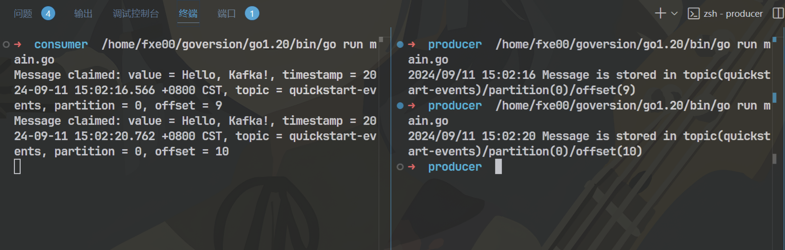
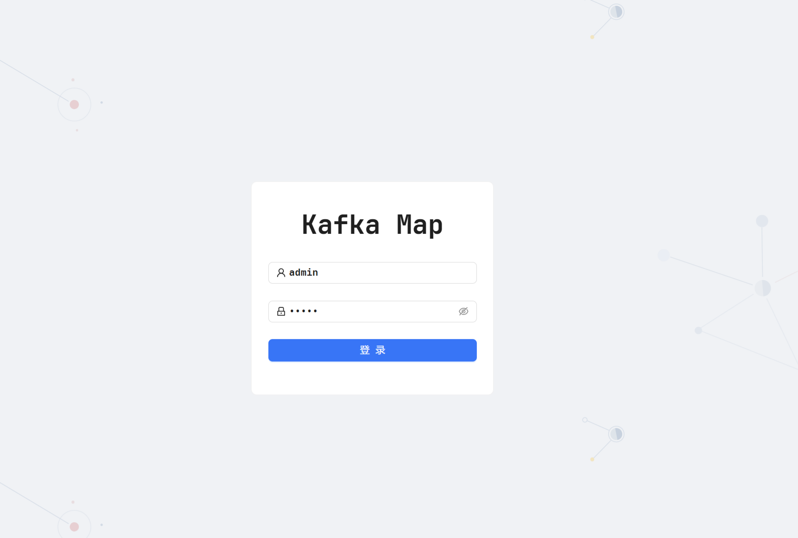
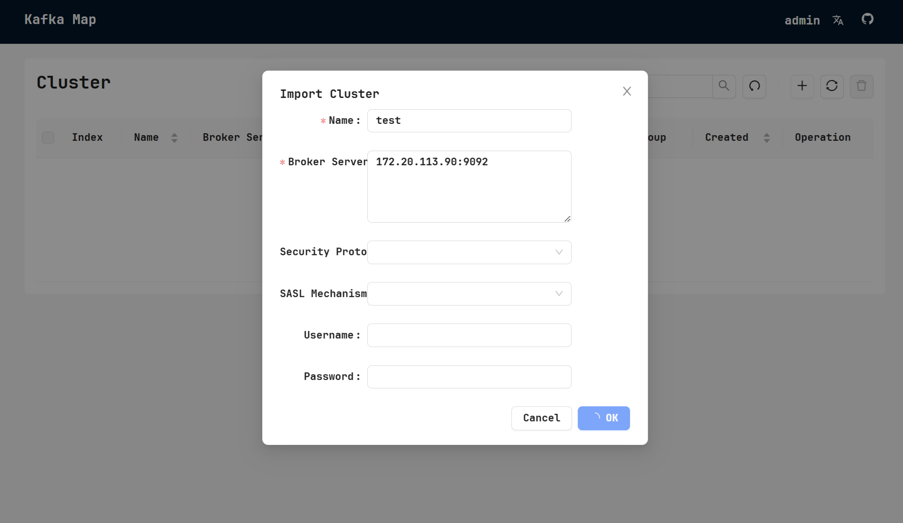
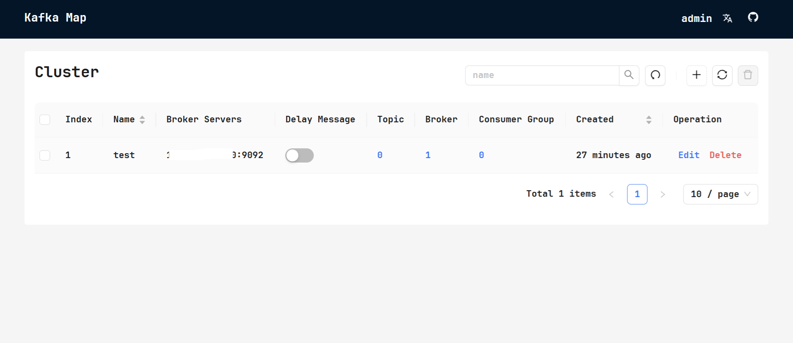
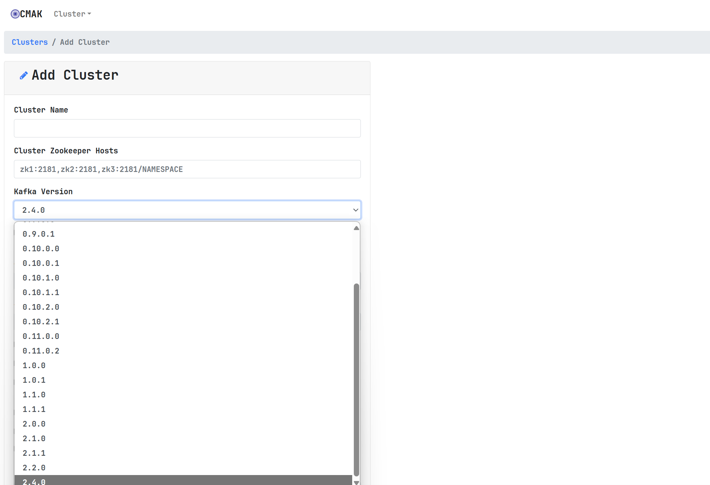

> 参考文档: https://kafka.apache.org/quickstart

文章编写时kafka版本为 3.8

### 0x00 Kafka 简要介绍:
Apache Kafka 是一个分布式流处理平台, 通常被用作消息队列系统. 将其简单的想象为一个管道, 数据由生产者推送到管道中, 由消费者从管道中拉取数据, 但是其具有 高吞吐量、可扩展性和容错性的特点.

理解kafka主要需要首先理解3个概念:
- `event`: 事件, 类似于消息, 是 `kafka` 中的基本单位, 每个 `event` 在 `partition` 中都有一个独立的编号, 称为 `offset`
- `topic`: 主题, 类似于消息队列, 消息被发布到主题中, 消费者订阅主题来获取消息.
- `partition`: 分区, 主题被分成多个分区, 每个分区是一个有序的、不可变的记录序列, 分区可以分布在不同的`broker`上, 提高吞吐量.
- `broker`: `broker` 是 `kafka` 集群中的一个节点, 负责存储和转发消息. 单挂的 `kafka` 也就只有一个`broker`

`topic` 可以类比为一个文件夹, 而 `event` 则是文件夹中的文件.
`partition` 是 `topic` 下的子集, 用于提高吞吐量( `Partition` 允许 `Kafka` 在多个服务器 `Broker` 上并行处理消息。每个 `Partition` 可以独立地被消费，这意味着多个消费者可以并行地从不同的 Partition 读取数据，从而提高整体的吞吐量。), 类似于文件夹下的子文件夹, 每个子文件夹中的文件(event)都是有序的, 不可变的.


### 0x01 Kafka 安装与使用
Kafka使用时需要两个东西, 一个cli工具包用于对Kafka服务端进行控制, 以及一个服务端。
下面流程完全依据官方的快速入门文档于本地环境进行, 使用的kafka版本为3.8

#### Step 1: Get Kafka
```shell
➜  ~  curl -o kafka_2.13-3.8.0.tgz https://dlcdn.apache.org/kafka/3.8.0/kafka_2.13-3.8.0.tgz
➜  ~  tar -xzf kafka_2.13-3.8.0.tgz
cd kafka_2.13-3.8.0
```

#### Step 2: Start the Kafka environment
Kafka服务端的建立官方给了4种方式:
1. Kafka with KRaft
2. Kafka with ZooKeeper
3. Using JVM Based Apache Kafka Docker Image
4. Using GraalVM Based Native Apache Kafka Docker Image

这里使用第3种方式, 直接拉取docker建立实验环境
```shell
➜  ~  docker pull apache/kafka:3.8.0
➜  ~  docker run -d -p 9092:9092 apache/kafka:3.8.0
```

#### Step 3: Create a topic to store your events
创建一个topic
bin/kafka-topics.sh --create --topic quickstart-events --bootstrap-server localhost:9092
```shell
➜  kafka_2.13-3.8.0  bin/kafka-topics.sh --create --topic quickstart-events --bootstrap-server localhost:9092
Created topic quickstart-events.

# 查看创建的topic相关信息
➜  kafka_2.13-3.8.0  bin/kafka-topics.sh --describe --topic quickstart-events --bootstrap-server localhost:9092
Topic: quickstart-events        TopicId: GSoPqe0BSB-QTt1hgxoF6w PartitionCount: 1       ReplicationFactor: 1    Configs: segment.bytes=1073741824
Topic: quickstart-events        Partition: 0    Leader: 1       Replicas: 1     Isr: 1  Elr:    LastKnownElr:
```

#### Step 4: Write some events into the topic
向topic中写入数据
```shell
➜  kafka_2.13-3.8.0  bin/kafka-console-producer.sh --topic quickstart-events --bootstrap-server localhost:9092
> hello
> world
> good
> job
> ^C
```

#### Step 5: Read the events
从topic中读取数据
```shell
➜  kafka_2.13-3.8.0  bin/kafka-console-consumer.sh --topic quickstart-events --from-beginning --bootstrap-server localhost:9092
hello
world
good
job
^C Processed a total of 4 messages
```

### go操作kafka
下面示例操作kafka使用 "github.com/IBM/sarama" 库
参考:
> https://pkg.go.dev/github.com/IBM/sarama

#### 构建producer向topic中发送消息
```go
package main

import (
	"log"

	"github.com/IBM/sarama"
)

func main() {
	// 配置 Sarama Producer
	config := sarama.NewConfig()
	config.Producer.RequiredAcks = sarama.WaitForAll
	config.Producer.Retry.Max = 5
	config.Producer.Return.Successes = true
	config.Producer.Partitioner = sarama.NewRandomPartitioner

	// 创建 Producer, 绑定Kafka 的 broker 地址
	producer, err := sarama.NewSyncProducer([]string{"localhost:9092"}, config)
	if err != nil {
		log.Fatalf("Failed to start producer: %s", err)
	}
	defer producer.Close()

	// 构建一个 Sarama ProducerMessage, 并指定 Topic 和消息内容. 然后使用 Producer 发送这个消息
	msg := &sarama.ProducerMessage{
		Topic: "quickstart-events",
		Value: sarama.StringEncoder("Hello, Kafka!"),
	}
	partition, offset, err := producer.SendMessage(msg)
	if err != nil {
		log.Fatalf("Failed to send message: %s", err)
	}
	log.Printf("Message is stored in topic(%s)/partition(%d)/offset(%d)\n", "quickstart-events", partition, offset)

	// 关闭 Producer
	if err := producer.Close(); err != nil {
		log.Fatalf("Failed to close producer: %s", err)
	}
}
```

```shell
➜  producer  /home/fxe00/goversion/go1.20/bin/go run main.go
2024/09/11 14:50:33 Message is stored in topic(test_topic)/partition(0)/offset(4)
➜  kafka_2.13-3.8.0  bin/kafka-console-consumer.sh --topic quickstart-events --from-beginning --bootstrap-server localhost:9092
hello
world
good
job
Hello, Kafka!
```

#### 构建consumer从topic中读取消息
```go
package main

import (
	"context"
	"fmt"
	"log"
	"sync"

	"github.com/IBM/sarama"
)

// 实现 sarama.ConsumerGroupHandler 接口, 定义如何处理消费的消息
type exampleConsumerGroupHandler struct{}

func (exampleConsumerGroupHandler) Setup(_ sarama.ConsumerGroupSession) error   { return nil }
func (exampleConsumerGroupHandler) Cleanup(_ sarama.ConsumerGroupSession) error { return nil }
func (h exampleConsumerGroupHandler) ConsumeClaim(sess sarama.ConsumerGroupSession, claim sarama.ConsumerGroupClaim) error {
	for msg := range claim.Messages() {
		fmt.Printf("Message claimed: value = %s, timestamp = %v, topic = %s, partition = %d, offset = %d\n", string(msg.Value), msg.Timestamp, msg.Topic, msg.Partition, msg.Offset)
		sess.MarkMessage(msg, "")
	}
	return nil
}

func main() {
	// 创建一个 Sarama 配置对象，并设置必要的属性，例如 Kafka broker 地址和消费者组
	config := sarama.NewConfig()
	config.Consumer.Return.Errors = true
	config.Version = sarama.V2_8_0_0                      // 指定 Kafka 协议版本
	config.Consumer.Offsets.Initial = sarama.OffsetNewest // 从最新的 offset 开始消费

	// 使用配置对象创建一个消费者组实例，并指定 Kafka 的 broker 地址和消费者组名
	group, err := sarama.NewConsumerGroup([]string{"localhost:9092"}, "my-consumer-group", config)
	if err != nil {
		log.Fatalf("Error creating consumer group: %v", err)
	}
	defer group.Close()

	ctx := context.Background()
	wg := &sync.WaitGroup{}
	wg.Add(1)

	// 消费消息
	go func() {
		defer wg.Done()
		for {
			if err := group.Consume(ctx, []string{"quickstart-events"}, exampleConsumerGroupHandler{}); err != nil {
				log.Panicf("Error from consumer: %v", err)
			}
			// check if context was cancelled, signaling that the consumer should stop
			if ctx.Err() != nil {
				return
			}
		}
	}()

	// Wait for the consumer to finish
	wg.Wait()
}

```




### kafka可视化工具
对于kafka的操作方式和数据观察方式在生产环境下可以使用可视化工具辅助更好的操控kafka

#### kafka-map
> https://github.com/dushixiang/kafka-map

简介:一个美观简洁且强大的kafka web管理工具
构建: 仍然采用docker构建的方式
```shell
➜  kafka-map git:(master) docker pull dushixiang/kafka-map:latest

# 官方给出的启动方式如下:
docker run -d \
    -p 8080:8080 \
    -v /opt/kafka-map/data:/usr/local/kafka-map/data \
    -e DEFAULT_USERNAME=admin \
    -e DEFAULT_PASSWORD=admin \
    --name kafka-map \
    --restart always dushixiang/kafka-map:latest

# 但是由于我只做本次实验, 不需要设置重启以及数据挂载, 将其简化为:
docker run -d \
    -p 8080:8080 \
    -e DEFAULT_USERNAME=admin \
    -e DEFAULT_PASSWORD=admin \
    --name kafka-map \
    dushixiang/kafka-map:latest
```

容器启动后即可通过浏览器访问`http://localhost:8080`来访问kafka-map登录界面


登入后台添加kafkfa集群的配置


:::warning
kafka-map配置连接的时候不知道为什么连接不上我的kafka容器, 猜测使用apache/kafka:3.8.0这个镜像启动的容器默认不支持外连(仅猜测)
于是这里我换了另一个镜像, 在dockerhub里搜索发现bitnami/kafka下载和使用量最大, 又怕本地占用磁盘空间就换成了bitnami/kafka在云服务器中进行部署
:::

云服务器中执行:

```shell
# 先用容器启动zookeeper
ubuntu@10-7-105-34:~$ docker pull bitnami/zookeeper:3.8.0
ubuntu@10-7-105-34:~$ docker run -d --name my-zookeeper \
  -p 2181:2181 \
  -e ALLOW_ANONYMOUS_LOGIN=yes \
  bitnami/zookeeper:latest
3f7387a42120487b031f45dda5bcc177b548273b408fb92d5da91d384a8bdedf

# 再启动kafka并设置账号密码为admin/123456
ubuntu@10-7-105-34:~$ docker pull bitnami/kafka:latest
ubuntu@10-7-105-34:~$ docker run -d --name my-kafka \
  -p 9092:9092 \
  -e KAFKA_BROKER_ID=1 \
  -e KAFKA_ZOOKEEPER_CONNECT=<your-ip>:2181 \
  -e KAFKA_ADVERTISED_LISTENERS=PLAINTEXT://<your-ip>:9092 \
  -e KAFKA_LISTENER_SECURITY_PROTOCOL_MAP=PLAINTEXT:PLAINTEXT \
  -e KAFKA_USERNAME=admin \
  -e KAFKA_PASSWORD=123456 \
  bitnami/kafka:latest
8053ff4ac8b707dcf5a13f35ccb44a9a7525e2ead962c25969e3c0b346b2c040
```

使用kafka-map添加配置重新连接, 连接成功, 可以在kafkamap里进行添加topic, 查看topic, 检查消息偏移等操作



:::warning
上述操作要在云服务器中开放2181和9092端口, 否则kafka容器会启动失败且kafka-map无法正常连接
:::

#### kafka-manager
> https://github.com/yahoo/CMAK

CMAK is a tool for managing Apache Kafka clusters
Kafka Manager 对 kafka 管理的配置需要依赖于zookeeper

还是使用docker部署的方式
```shell
docker pull hlebalbau/kafka-manager
docker run -d --name my-kafka-manager \
    -p 9000:9000 \
    -e ZK_HOSTS="<your-ip>:2181" \
    -e APPLICATION_SECRET="123456" \
    hlebalbau/kafka-manager
```


:::caution
进入之后发现集群为空, 在实验过程中我确保kafka和kafka-manager都正确连接到了zookeeper, 猜测可能是kafka-manager最高只支持2.x的kafka而导致失败(目前没有想到其他原因, 太菜了..), 这个地方留个坑。目前如果从kafka-map和kafka-manager中选择, 我会选择kafka-map, 简单易用.
:::

### 其他
本篇为kafka使用第一篇, 后续有时间会对kafka的官方文档进行更细致的学习, 包括配置, 架构理念等。