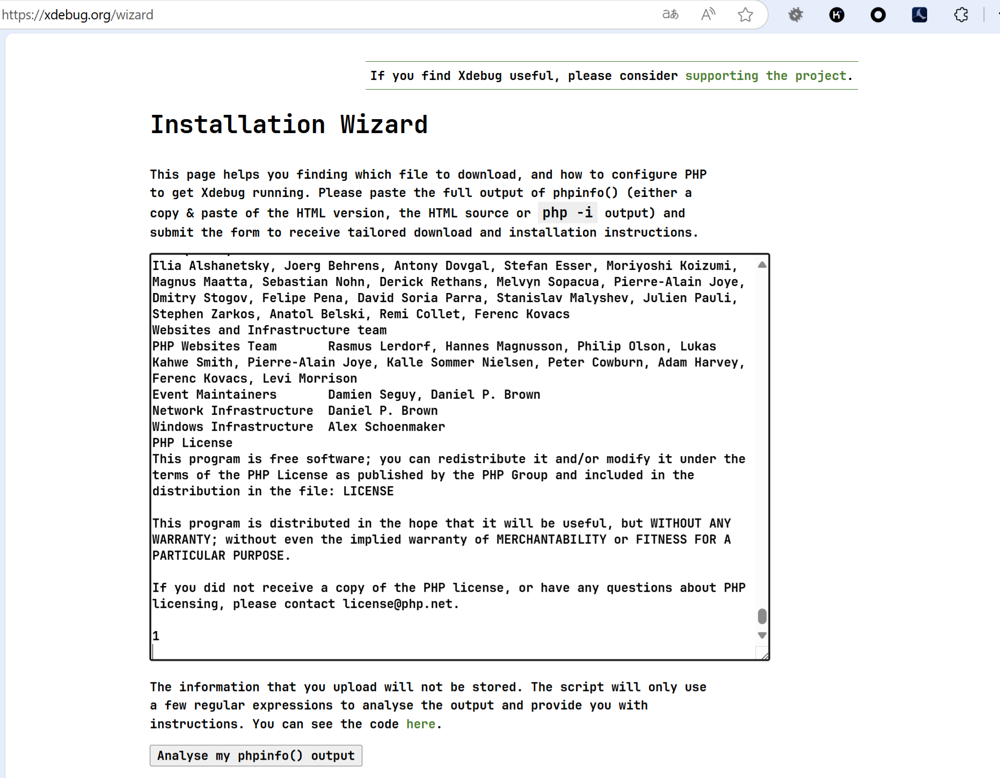
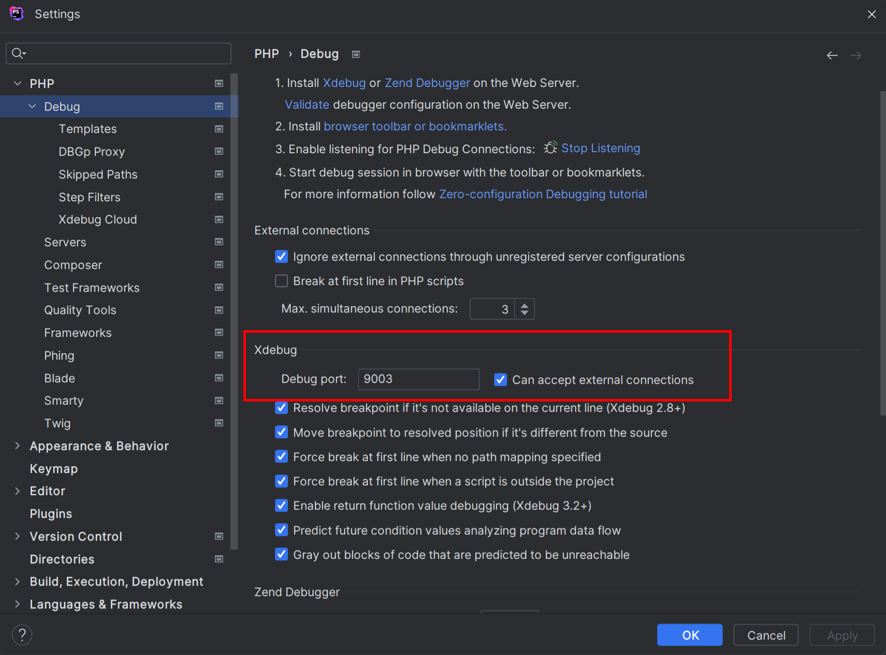
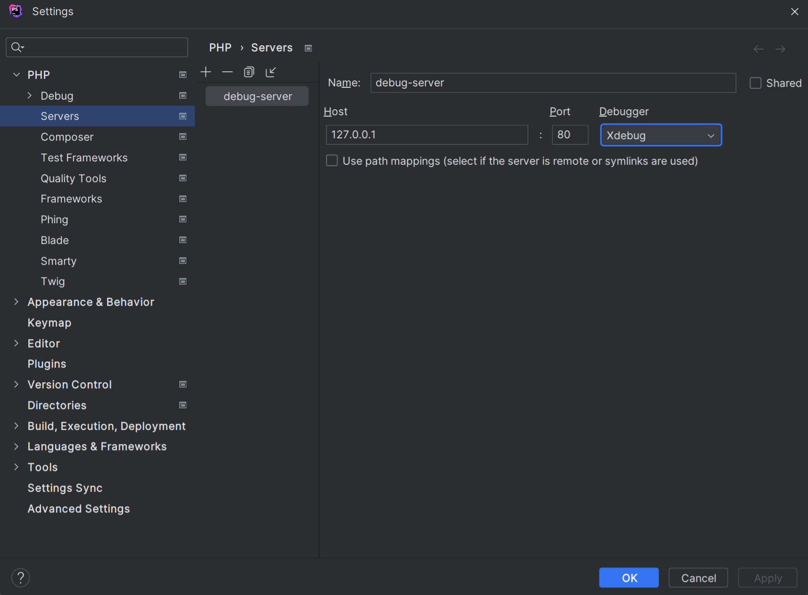
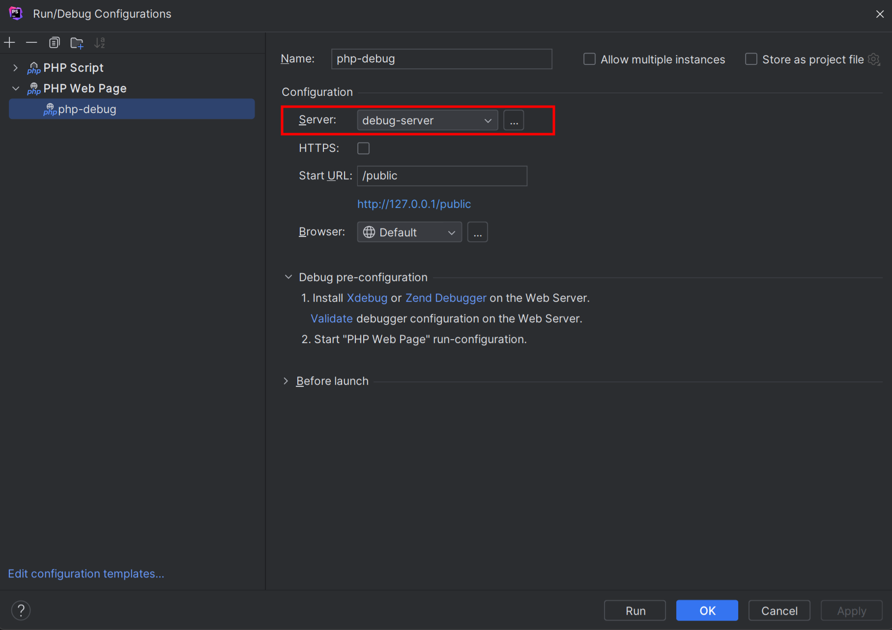
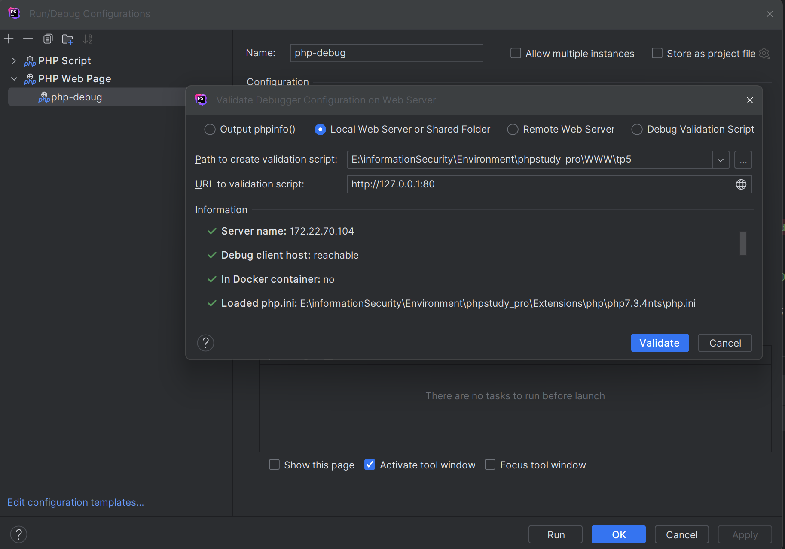
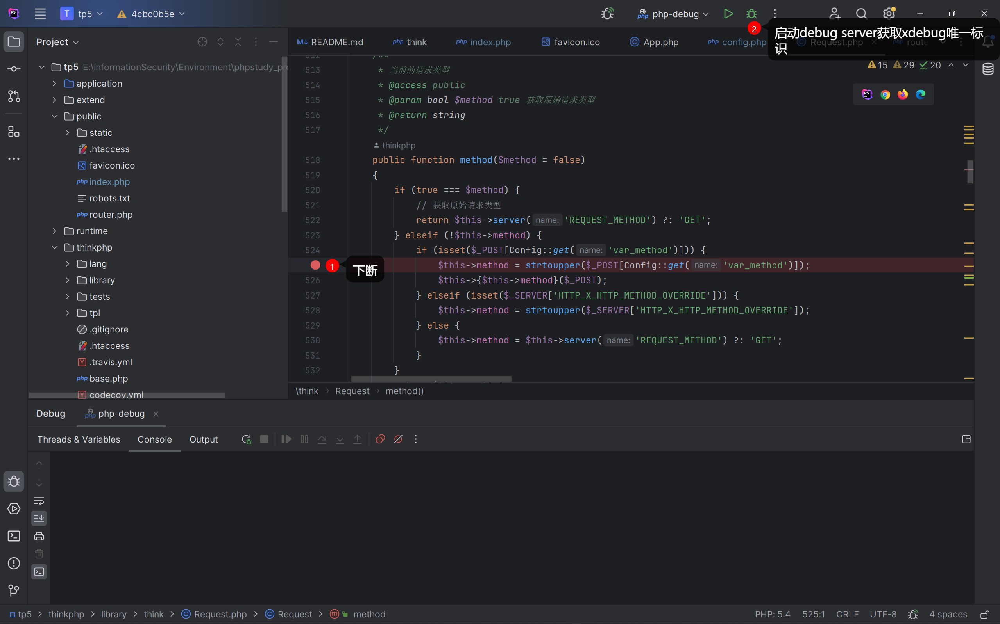

以下配置以phpstudy_pro内置的php7.3.4nts为例, 其他版本php同理

### 0x00. 为php安装xdebug扩展
在网站根目录内写一个phpinfo.php
```php
<?php
echo phpinfo();
?>
```

访问phpinfo.php, 将全部内容复制到 `https://xdebug.org/wizard`


**根据输出提示安装xdebug.dll**, 并将以下内容添加到php.ini中, xdebug.clinet_host为xdebug监听的地址

```ini
[xdebug]
zend_extension = xdebug
xdebug.remote_enable= 1
xdebug.remote_connect_back= 1
xdebug.remote_port = 9003
xdebug.mode = debug
xdebug.client_host = 127.0.0.1
```

### 0x01. 配置phpstorm
先对齐xdebug监听端口, 设置 -> debug (xdebug port) 设置为9003



再配置一个phpstorm内部的debug server



配置项目debugger, 选择刚刚配置好的debug server



最后validate全部通过即配置成功



### 0x02断点调试
下面是一个调试例子



默认浏览器打开后会发现请求参数跟了一个?XDEBUG_SESSION_START=11646, 这样的标识, 后续用浏览器, burpsuite, postman等任何工具发送请求时携带该标识, 均可成功断点


